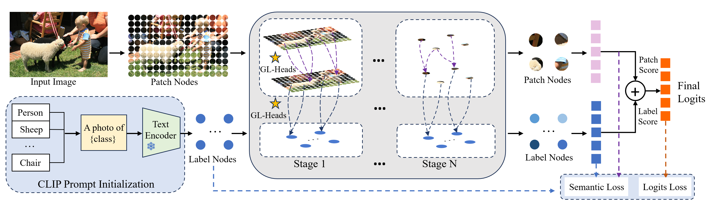

# GLSA
**💡This is the official implementation of the paper "Global-Local Graph Convolutional Network with Semantic Alignment for Long-Tailed Multi-Label Image Recognition"**.  

  Long-tailed multi-label image recognition is a challenging task due to its combinatorial nature and the long-tailed distribution problem. In recent years, neural networks have achieved remarkable progress, but still suffer from performance imbalance between head and tail classes and limited feature enhancement capability. To address this issue, we propose a novel and effective method called Global-Local Graph Convolutional Network with Semantic Alignmen (GLSA), which which employs the global-local multi-head structure to capture information from multiple perspectives, while applying the semantic alignment strategy to both the image and label branches. Specifically, GLSA initializes label embeddings using the CLIP text encoder to exploit implicit semantic correlations. To promote consistency between visual and semantic responses, we measure the response discrepancy between the image and label branches, as well as the semantic shift of the learnable labels, and incorporate them as an auxiliary loss. In addition, to model the relationship between each target label and the corresponding image regions, we adopt global and local heads for graph construction and message passing.  
   
<div align=center></div>  

## 🔧 Installation

To run experiments, first clone the repository and set up the environment.

```
$ git clone https://github.com/rabiitmiao/GLSA.git
$ cd GLSA
$ conda create -n mmlab python=3.8 pytorch==1.10.1 torchvision==0.11.2 cudatoolkit=11.3 -c pytorch -y
$ conda activate mmlab
$ pip install openmim
$ mim install mmcv-full==1.5.0
$ pip install -e .
```  
